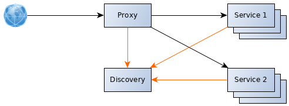

# Minimal Spring Cloud example

In this example project we are targeting the following microservices architecture.

## Run project

Go to `scripts` folder and run once `./discovery.sh` and `./proxy.sh`. As often you want, run `./service.sh 1 <instance name>` and `./service.sh 2 <instance name>`

The service discovery will be accessible at [localhost:8761](http://localhost:8761/), microservice 1 at [localhost:8080/service1/info](http://localhost:8080/service1/info) and microservice 2 at [localhost:8080/service2/info](http://localhost:8080/service2/info)
